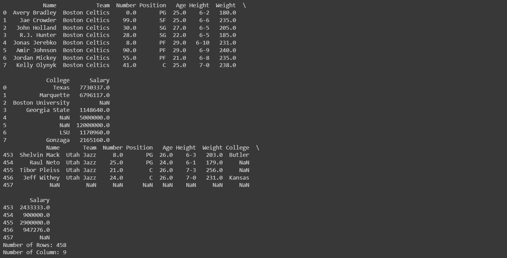

# Read-from-CSV
## AIM:
## To write a python program to read contents from a CSV file.
## ALGORITHM:
### Step 1: Import pandas module as pd.
### Step 2: Using pd.read_csv() method read the CSV file.
### Step 3: Using df.head() print the first 10 rows of the CSV file.
### Step 4: Using df.tail() print the last 5 of the CSV file.
### Step 5: Using len(df.axes[]) print the toal no.of rows and columns with argument 0 for row and argument 1 for column.

## PROGRAM:
Developed by: Anish Raj P 
Register no:212222230010 
import pandas as pd 
f=pd.read_csv('/content/nba.csv') 
print(f.head(8)) 
print(f.tail()) 
print('Number of Rows:',len(f.axes[0])) 
print('Number of Column:',len(f.axes[1])) 
## OUTPUT:

## RESULT:
Thus the program is executed successfully.